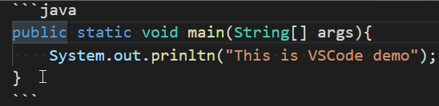
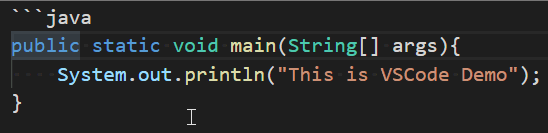
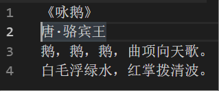
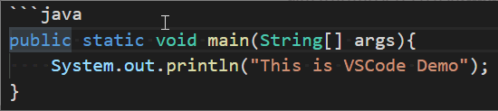
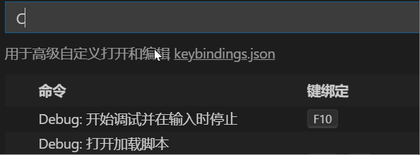

# 如何做到双手不离键盘

介绍光标的移动，文本的选择，文本删除，快捷键的绑定

## 光标移动

VSCode可以针对单词、行、代码块、整个文档的维度进行多种光标移动方式

+ 单词的光标移动
 快捷键:Ctrl+左右按键，每次移动一个单词的开头或者末尾，如果是一连串的字符比如是个句子就会移动到句子的末尾，一键移动一行的开头或者末尾是`Home`和`End`键
 

+ 代码块的移动
 快捷键:Ctrl+Shift+\,可以在{},()之间移动，如果是其他字符会自动向右定位到这些字符，是不是很智能。
 

+ 整个文档开头和结束
 快捷键:Ctrl+Home或者End。
 

## 文本选择

文本的选择就是在对光标的移动快捷键加shift，整个对代码块是无效的，但是从命令面板里可以，打开命令面板(C+S+P),输入"选择括号所有内容"。也可以单独为这个命令绑定快捷键

+ 选择一个单词
 快捷键:Ctrl+Shift+左右按键。
 

## 删除选择

大部分的删除都是先选择后，按下Del键，命令面板里有两个方便的命令:删除左侧所有内容和删除右侧的内容，它们默认没有绑定快捷键。

`Shift+Del` 删除一行

## 自定义快捷键

在命令面板中输入"打开键盘快捷方式",可以打开快捷键设置，可以直接输入中文可以过滤出对应的功能，也可以输入快捷键对用的按钮就可以直到对应的功能

 