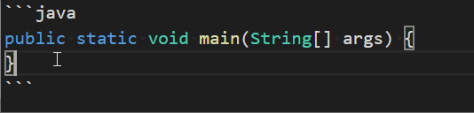
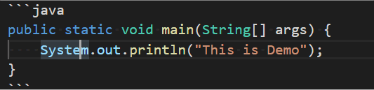
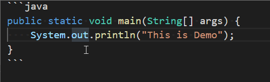
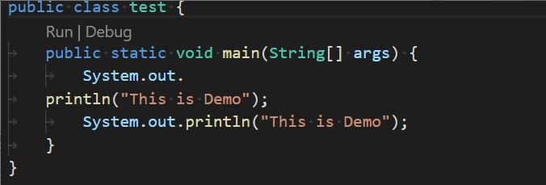
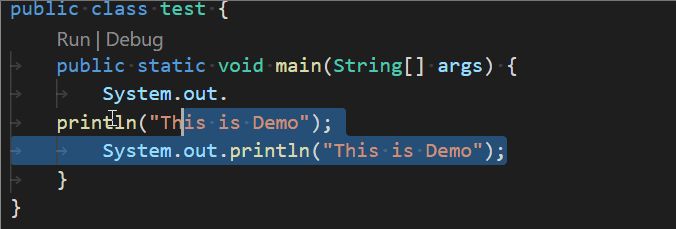
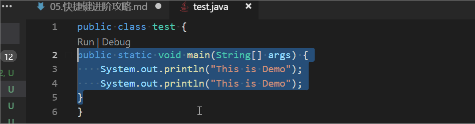

# 快捷键进阶攻略

+ 删除一行
 快捷键:Ctrl+Shift+K
 

+ 剪切一行
 快捷键:Ctrl+x
 

+ 在上面或者下面插入一行
 快捷键:Ctrl+Enter在下面插入新一行，Ctrl+Shift+Enter在上面插入新一行
 

+ 移动一行
 快捷键:Alt+上下键
 

+ 复制粘贴一行
 快捷键:Shift+Alt+上下键
 

+ 添加注释
 快捷键:Ctrl+/ 行注释，Shift+Alt+A 块注释
 

+ 代码格式化
 快捷键:Alt+Shift+F对整个文档进行格式化，对于陌生的格式会提示格式化程序。Ctrl+K Ctrl+F对选择的代码被格式化
 
 

+ 代码缩进
 代码缩进只有命令没有快捷键，在命令面板上输入"重新缩进所选行"
 

+ 返回上次光标的位置
 快捷键:Ctrl+U
