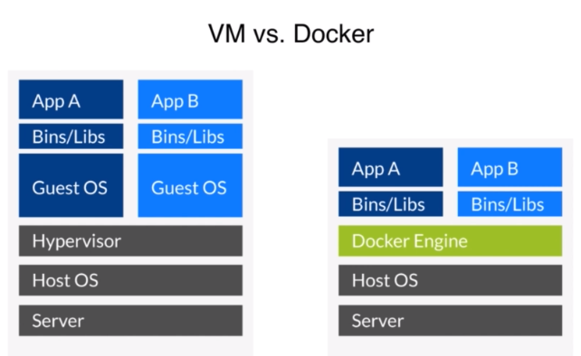

# Docker介绍

+ Docker解决什么问题？
很好的理顺了开发和运维的环境的差异，使得开发和运维可以用同一种语言来沟通。与Devops，持续交付，微服务等概念都是相辅相成的。
+ 预备知识
Linux命令行和bash
+ 类比
Docer理解为轻量级虚拟机，但是不完全是。它比虚拟机少了虚拟层，所以它需要的内存更小。

+ Docker的Windows安装

  1. Window10以前需要安装Docker Toolbox，它是用Oracle Virtual Box,而Window10使用Hyper-V
  2. Window10在安装前要开启Hyper-V，在控制面板->程序与功能->启用或关闭Window功能->在Hyper-V打勾
  3. 下载[Docker for Windows Installer](https://download.docker.com/win/stable/Docker%20for%20Windows%20Installer.exe),安装Docker

## Docker架构

  
Docker daemon是核心，可以下载，运行Docker的各种镜像。

## docker加速器

+ windows配置
在docker图标点击settings，在Daemon选项卡，Registry mirrors填入`http://f1361db2.m.daocloud.io`

## Docker下载镜像

`docker pull imagename`拉取镜像文件，一般镜像都在外网所以先要配置docker加速器  
`docker pull ubuntu`拉取ubuntu  
`docker images`展示本地的镜像  
`docker run -p 8080:80 -d nginx` 运行nginx  
p参数将容器的80端口映射到本地的8080端口  
d参数运行程序直接返回  
`docker ps`显示正在跑的容器  
