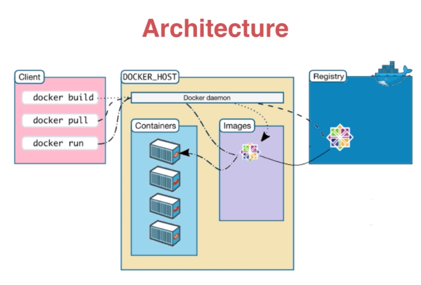

# Docker介绍

+ Docker解决什么问题？
很好的理顺了开发和运维的环境的差异，使得开发和运维可以用同一种语言来沟通。与Devops，持续交付，微服务等概念都是相辅相成的。
+ 预备知识
Linux命令行和bash
+ 类比
Docer理解为轻量级虚拟机，但是不完全是。它比虚拟机少了虚拟层，所以它需要的内存更小。

+ Docker的Windows安装

  1. Window10以前需要安装Docker Toolbox，它是用Oracle Virtual Box,而Window10使用Hyper-V
  2. Window10在安装前要开启Hyper-V，在控制面板->程序与功能->启用或关闭Window功能->在Hyper-V打勾
  3. 下载[Docker for Windows Installer](https://download.docker.com/win/stable/Docker%20for%20Windows%20Installer.exe),安装Docker

## Docker架构

  
Docker daemon是核心，可以下载，运行Docker的各种镜像。

## docker加速器

+ windows配置
在docker图标点击settings，在Daemon选项卡，Registry mirrors填入`http://f1361db2.m.daocloud.io`

## Docker简单命令解释

`docker pull imagename`拉取镜像文件，一般镜像都在外网所以先要配置docker加速器  
`docker pull ubuntu`拉取ubuntu容器  
`docker images`展示本地的镜像  
`docker run -p 8080:80 -d nginx` 运行nginx  
p参数将容器的80端口映射到本地的8080端口  
d参数运行守护进程，命令执行完成后就返回  
`docker ps`显示正在跑的容器  
`docker cp index.html d1fa7964b2c2://usr/share/nginx/html`
将index.html拷贝到docker容器中，再次访问了nginx页面就显示index.html,这些改动在没有保存的情况是一次性的。  
`docker commit -m 'fun' d1fa7964b2c2 nginx-fun` 将改动保存为新的镜像  
`docker rmi 46e964661343` 删除镜像  
`docker rm df5d26e798a4` 删除容器，删除镜像前要停容器和删除容器  

## dockerfile构建镜像

1. 创建一个Docerfile的文件，内容如下：

```bash
FORM alpine:latest
MAINTAINER hc
CMD echo 'hello docker'
```

FORM表示镜像来自alpine的最新版本，alpine是专门为docker做的极小的linux镜像
MAINTAINER是维护者名字
CMD

2. 执行命令`docker build -t hello_docker .` 将当前目录文件都打入新的镜像中

制作镜像2

``` bash
FROM ubuntu
MAINTAINER huc
RUN apt-get update
RUN apt-get install -y nginx
COPY index.html /var/www/html
ENTRYPOINT ["/usr/sbin/nginx","-g","daemon off;"]
EXPOSE 80
```

`FROM ubuntu`基于ubuntu系统
`RUN apt-get update`是更新系统
`RUN apt-get install -y nginx` 静默安装nginx
`COPY index.html /var/www/html` 复制当前目录index.html到/var/www/html目录
`ENTRYPOINT ["/usr/sbin/nginx","-g","daemon off;"]` 执行命令的参数
`EXPOSE 80` 暴露80端口

这里由点问题，下载ubuntu太慢，需要缓存国内镜像

``` bash
RUN sed -i 's/archive.ubuntu.com/mirrors.ustc.edu.cn/g' /etc/apt/sources.list
```

docfile命令总结

|命令|用途|
|----|----|
|FROM|基于镜像|
|RUN|执行命令|
|ADD|添加文件|
|COPY|拷贝文件|
|CMD|执行命令|
|EXPOSE|暴露端口|

COPY只能拷贝命令，ADD可以添加远程文件，比如FTP地址

## 镜像分层

Dockerfile中的每一行都产生一个新层

FROM alpine:latest 4e38e38c8ce0
MAINTAINER xbf fb1aabf4427b
CMD echo 'hello docker' 3df065bfdff6


红色的是命令行，这些命令产生的层是只读的，一旦镜像运行成容器后会产生一个容器层，它是可读可写的。分层的好处是，当多个容器由层是共享的会将容器的存储小很多。

## volume介绍

提供独立于容器之外的持久化存储
