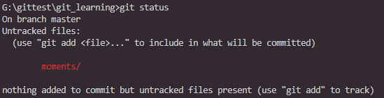
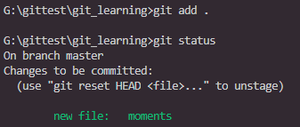

# git基本

## git前的基本配置

+ 配置user信息

配置user.name和user.email

`git config --global user.name 'your_name'`
`git config --global user.email 'your_email@domain.com'`

为什么需要配置username和email?
主要为了方便沟通，在代码评审时的操作需要发邮件给对方

### config的3个作用域

```git
git config --local 只对某个仓库有效(缺省等同于local)
git config --global 对当前用户所有仓库有效
git config --system 系统所有登录的用户有效
```

+ 显示config的配置
`git config --list --[local|global|system]`

### 建立仓库并配置local

1. 把已有的项目代码纳入Git管理

```cmd
cd <projectfolder>
git init
```

2. 新建的项目直接用Git管理

```cmd
cd <emptyfolder>
git init projectname 会创建同名的文件夹
```

### 认识暂存区和工作区

暂存区是正式提交前的区域，通过`git add`添加,也可以回退，是git比较有特色的概念。
刚刚拷贝文件的是不受git管控的，通过`git status`可以查看

通过`git add`命令添加到暂存区

`git add .` 添加所有文件
`git add [filepath|folderpath]`
`git add -u` 更新暂存区的文件

+ 修改名称
`git mv readme readme.md`

+ git log 参数
`git log --oneline` 简洁查看当前分支提交日志
`git log --oneline -all` 查看所有分支提交日志
`git log --all --graph` 图形化log日志
`git log --all --oneline -n4` 显示前4条日志

### .git目录

使用git init命令后会在当前目录创建.git目录

HEAD文件是记录当前工作分支
`ref:refs/heads/master
config文件记录local的配置，比如用户名和邮箱
refs目录 保存了分支的信息，每个文件对应一个分支，文件内容记录分支最后提交信息
objects目录

查看git提交信息
`git cat-file -t hashid` 查看最后提交的类型

```cmd
git cat-file -t cd0f6b734951779ee00b923a31b28a7b2586cdc6
commit
```

### 不同人修改了同文件的不同区域如何处理

基于远端分支检出新本地分支
`git checkout -b feature/new_command origin/feature/new_command`

删除本地分支
`git branch -d <BranchName>`

feature/new_command 3265558 [ahead 1, behind 1] ddtest1.log
