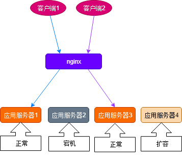

# 反向代理的原理

## 负载均衡

nignx为应用服务集群工作，将请求转发到有效服务器中，对于客户端是透明。

+ 客户端1的请求，通过nginx它选择了转发到应用服务器1。
+ 客户端2的请求被转发到应用服务器3，
+ 由于应用服务器2是宕机的状态，不会转发任何请求，
+ 应用服务器4是扩容状态，nginx也不会转发任务请求

## AKF扩展立方体

+ X轴也叫水平复制，将应用复制n份(物理或者逻辑)来负担请求，但是解决不了某个服务由于请求时间过长
+ Y轴扩展是基于服务或者具体基于URL对功能进行分发。处理请求的节点就可以根据负责的服务定制化。
+ Z轴扩展将用户IP地址或者其他信息映射到某个特定的服务或者集群(基于IP的CDN就近访问)

## 反向代理

反向代理分为四层和七层代理
四层代理是就udp和tcp代理，只是请求转发
七层代理可以根据请求头的标记识别具体的应用协议，转换为对应请求转发对应协议服务器上。

