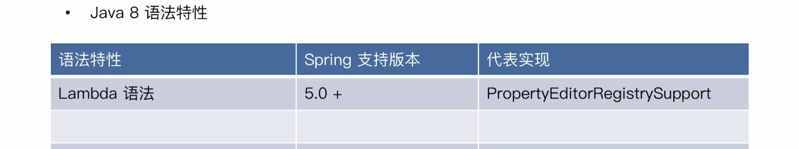
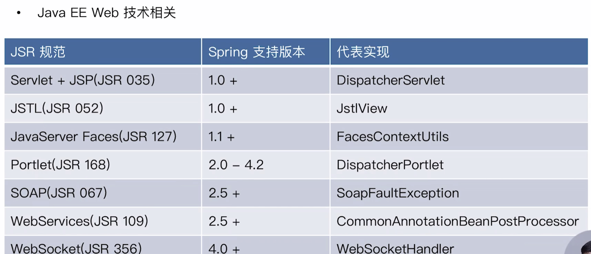
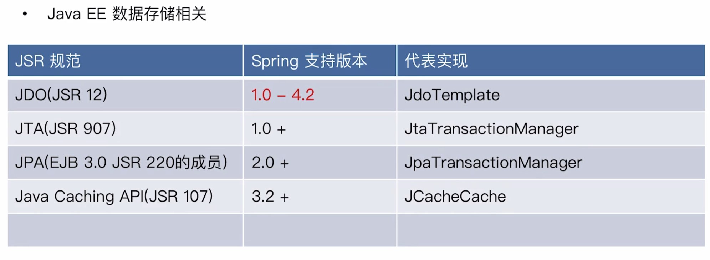
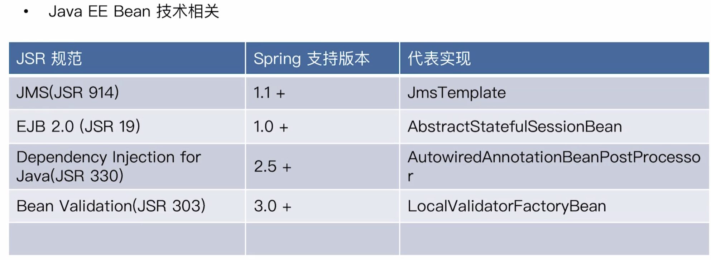

# spring模块

## 核心特性(Core)

+ IoC容器
+ Spring事件
+ 资源管理(Resources)
+ 国际化(i18n)
+ 校验(Validation)
+ 数据绑定(DataBinding)
+ 类型转换(Type Conversion)
+ Spring表达式(Spring Express Language)
+ AOP

## 数据存储

+ JDBC
+ 事务抽象 来源EJBspring做了抽象
+ DAO支持 简化写法 SQLException封装
+ O/R映射(O/R Mapping) JPA默认使用Hibernate
+ XML编列(XML Marshalling)

## Web技术

+ Web Servlet技术栈
  + SpringMVC
  + WebSocket
  + SockJS
+ Web Reactive技术栈
  + SpringWebFlux
  + WebClient
  + WebSocket

## 技术整合

+ 远程调用(Remoting)
+ 消息服务(JMS)
+ 连接架构(JCA)
+ 管理扩展(JMX)
+ 邮件Email
+ 本地任务(Tasks)
+ 本地调度(Scheduling)
+ 缓存抽象(Cache)
+ Spring测试

## 测试

+ 模拟对象
+ TestContext框架
+ Spring MVC测试
+ Web测试客户端

## Java版本和Spring

Spring4开始spring的体系开始成熟

## Spring模块化设计

Spring将模块打散分成若干个Jar包，按需加载

context+bean组合spring Ioc容器，它是依赖SpringCore包

## Java语法特性和Spring各个版本中使用

## JDK API实践:Spring怎样取舍

Java I/O,集合,反射，动态代理等API的使用

+ 小于Java5
反射，JavaBean，动态语言
+ Java5
并发框架(JUC),格式化(Formatter),JMX,Instrumentation,XML处理(DOM,SAX,XPath,XSTL)
+ Java6
JDBC4.0(JSR221),JAXB2.0(JSR222),可插拔注解处理API(JSR269),Common Annotations(JSR 250)，Java Compiler API(JSR 199),Scriping in JVM(JSR223)
+ Java7
NIO2(JSR 203),Fork/Join框架(JSR 166),invokedynamic字节码(JSR 292)
+ Java8
Stream API(JSR 335),CompletableFuture(JUC),Annotation on Java Types(JSR 308),Data and Time API(JSR 310),可重复的Annotation(JSR 337),Javascript运行时(JSR 223)
+ Java9
Reactive Streams Flow API(JUC),Process API Updates(JEP 102),Variable Handles(JEP 193),Method Handles(JEP 277),Spin-Wait Hints(JEP 285),Stack-Waling API(JEP 259)

## JavaEE API整合

为什么Spring要和JavaEE整合

## Spring编程模型实现

+ 面向对象编程
  + 契约接口:Aware,BeanPostProcessor
  + 设计模式:观察者，组合模式，模板模式
  + 对象继承:Abstrace类
+ 面向切面编程
  + 动态代理:JdkDynamicAopProxy
  + 字节码提升:ASM,CGLib,AspectJ
+ 面向元编程
  + 注解:模式注解(@Componet,@Service)
  + 配置:Environment抽象，PropertySource
  + 泛型：GenericTypeResolver
+ 函数驱动
  + 函数接口：ApplicationEventPublish
  + Reactive:WebFlux
+ 模块驱动
  + Maven Artifacts
  + OSGI Bundles
  + Java9 Automatic Modules
  + Spring @Enable*
