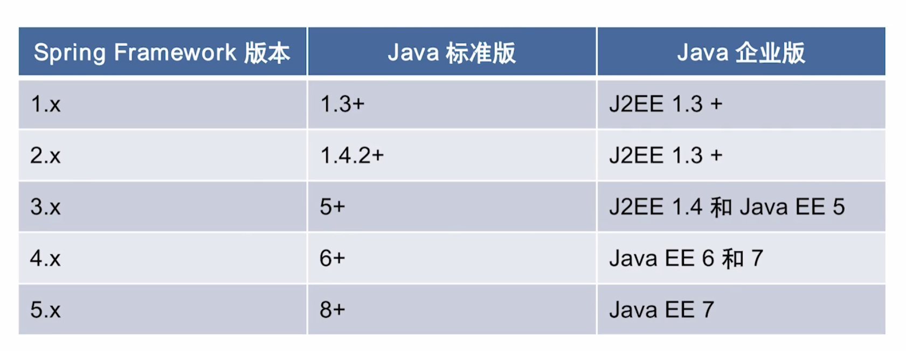
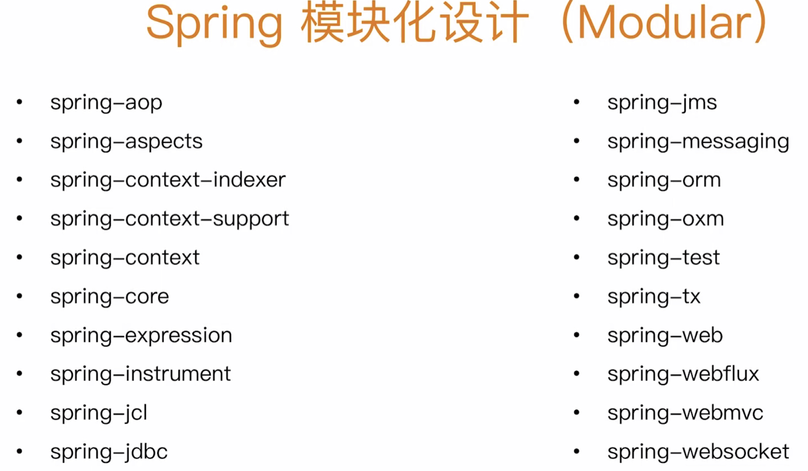
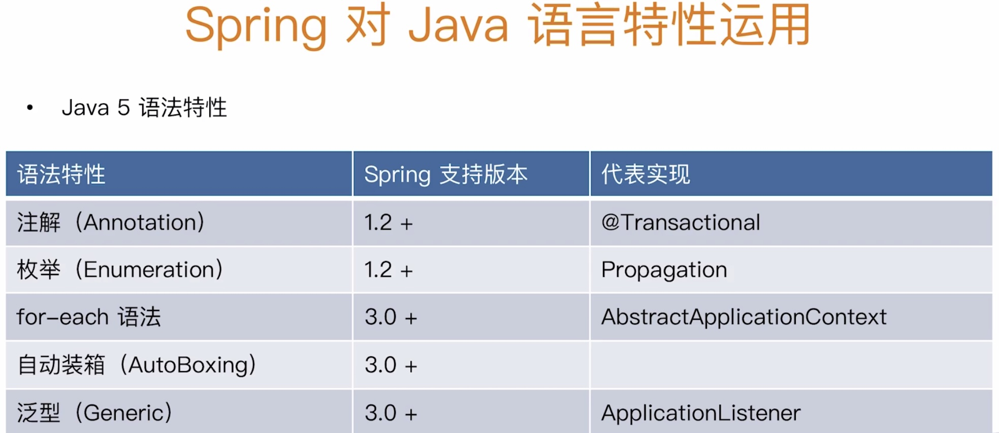
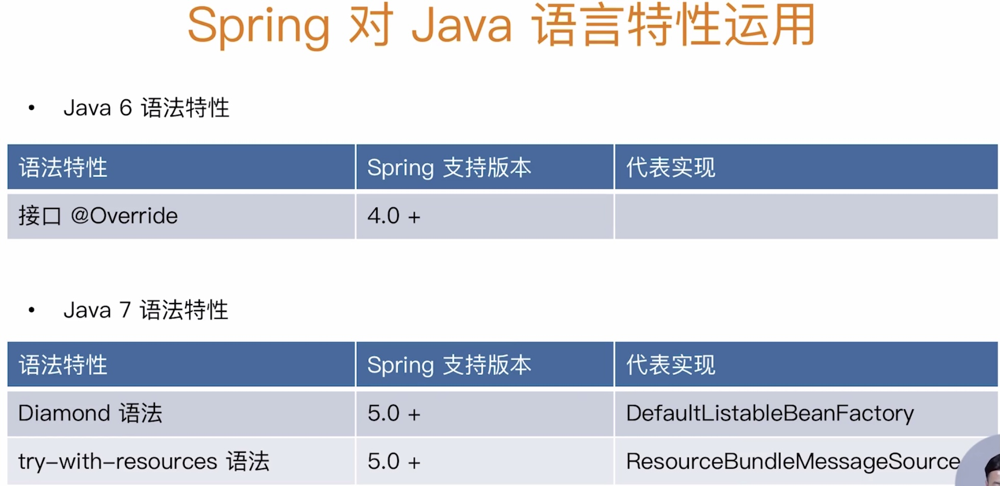

# spring模块

## 核心特性(Core)

+ IoC容器
+ Spring事件
+ 资源管理(Resources)
+ 国际化(i18n)
+ 校验(Validation)
+ 数据绑定(DataBinding)
+ 类型转换(Type Conversion)
+ Spring表达式(Spring Express Language)
+ AOP

## 数据存储

+ JDBC
+ 事务抽象 来源EJBspring做了抽象
+ DAO支持 简化写法 SQLException封装
+ O/R映射(O/R Mapping) JPA默认使用Hibernate
+ XML编列(XML Marshalling)

## Web技术

+ Web Servlet技术栈
  + SpringMVC
  + WebSocket
  + SockJS
+ Web Reactive技术栈
  + SpringWebFlux
  + WebClient
  + WebSocket

## 技术整合

+ 远程调用(Remoting)
+ 消息服务(JMS)
+ 连接架构(JCA)
+ 管理扩展(JMX)
+ 邮件Email
+ 本地任务(Tasks)
+ 本地调度(Scheduling)
+ 缓存抽象(Cache)
+ Spring测试

## 测试

+ 模拟对象
+ TestContext框架
+ Spring MVC测试
+ Web测试客户端

## Java版本和Spring

Spring4开始spring的体系开始成熟

## Spring模块化设计

Spring将模块打散分成若干个Jar包，按需加载

context+bean组合spring Ioc容器，它是依赖SpringCore包

## Java语法特性和Spring各个版本中使用

