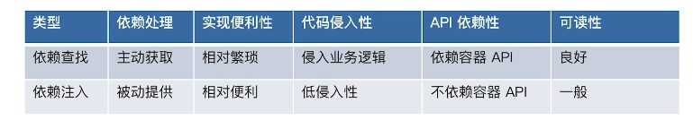

# SpringIoC基础

## 重新认识IoC

### IoC发展简介

+ 1983年，Richard.E.Sweet提出好莱坞原则:不要打电话给我，我会打电话给你
+ 1988年，Ralph.E.Johnson和Brian Foot提出控制反转
+ 1996年，Michael Mattson将控制反转命名为好莱坞原则
+ 2004年，Martin Fowler提出博客中提出控制反转容器和依赖注入的理解
+ 2005年，Martin Fowler对控制反转作出进一步说明

### IoC主要实现策略

+ 服务定位模式
EJB中通过JNDI获取组件或者DataSource等
+ 依赖注入
  + 构造注入
  + 参数注入
  + Setter注入
  + 接口注入
+ 上下文依赖查询
JavaBeans中有通用的上下文BeanContext，它可以传输和管理Bean的层次性
+ 模板方法
+ 策略方法
  主要有两种依赖查找和依赖注入
  + 依赖查找
  容器提供了回调的机制到我们的组件，并提供负责查询的上下文，EJB和Apache Avalon使用这种方法
  + 依赖注入
  组件不需要查找，由容器自动注入，注入方式包括构造注入，Setter注入

### IoC容器的职责

+ 实现和执行任务之间要实现解耦
+ 要关注模块在设计上的目标，而不是实现
+ 释放这个模块的，要让其他系统知道如何使用而不是依赖某个契约(API),比如JNDI获取对应的服务，这里就依赖了JNDI的lookup方法。
+ 模块取消时候关注的副作用

#### 主要职责

+ 通用职责
+ 依赖处理
  + 依赖查找
  + 依赖注入
+ 生命周期管理
  + 容器
  + 托管的资源(JavaBean或者其他资源)
+ 配置
  + 容器
  + 外部化配置
  + 托管的资源(JavaBean或者其他资源)

### IoC容器的实现


### 传统IoC容器实现

JavaBeans也是IoC容器吗?

[JavaBeans](https://www.oracle.com/technetwork/java/javase/tech/index-jsp-138795.html)
[BeanContext](https://docs.oracle.com/javase/8/docs/technotes/guides/beans/spec/beancontext.html)

+ java.beans.Introspector使用内省模式解析Bean
+ java.beans.BeanInfo#getPropertyDescriptors描述了Bean的属性，读取和写入方法
+ java.beans.PropertyEditorSupport注册属性编辑器在设置值进行拦截

### 轻量级IoC容器

如何界定IoC容器的“轻重”

+ 轻量级容器的特征
  + 能够管理应用代码的运行，比:启动和停止，像生命周期
  + 快速启动的能力
  + 容器不需要特别的配置(主要是争对EJB来说)
  + 轻量级的内存占用和最小化API依赖
  + 容器可以管控的渠道，它用于管理和部署一些细粒度的对象和粗粒度的组件

+ 轻量级容器的好处
  + 避免了单一容器
  + 最大化的代码重用
  + 更大程度上面向对象
  + 更多的产品化
  + 更好的测试性

### 依赖查找VS依赖注入

为什么Spring总会强调后者，而选择性忽视前者？



```java
//依赖查找
Bean someBean = (Bean)contenxt.getBean("beanName");

//依赖注入
@Autowired
private SomeService service;
```

### 构造器注入 VS Setter注入

为什么Spring官方文档的解读会与作者的初心出现偏差？

+ SpringFramework团队
鼓励使用构造器注入，保证了你的应用组件是不变的对象来确保依赖它的对象不会为空。构造器注入如果还依赖其他组件那么跟需要在构造时候完成这些依赖的初始化。构造注入还有问题是如果构造方法的参数过多会使类承担过多的责任。
setter注入主要用于可选性注入，主要是设置属性的默认值。它可能是空的(@autowired的required属性可以控制)，另一个好处是setter注入后还可以重新注入

+ Expert One-on-One书作者
Setter注入会更好，优点如下:
  + JavaBean Properties本来就是用在GUI中，所以对IDE支持更好
  + JavaBean Properties是自描述
  + 使用标准的property-editor机制进行类型转换
  + 已经存在的JavaBeans能不用修改就能使用到IoC容器中(BeanContext)
  + Setter方法一般都有对应的Getter方法，这种规律配置更方便
不方便地方:
  + 在设置属性的顺序上不能保证，如果是构造器就没有这个问题。

### 面试题
