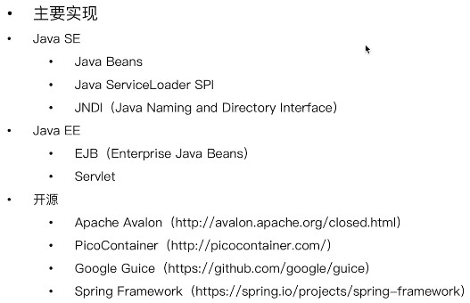
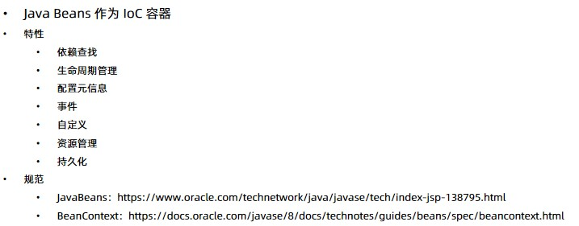

 # SpringIoC基础

## 重新认识IoC

### IoC发展简介

+ 1983年，Richard.E.Sweet提出好莱坞原则:不要打电话给我，我会打电话给你
+ 1988年，Ralph.E.Johnson和Brian Foot提出控制反转
+ 1996年，Michael Mattson将控制反转命名为好莱坞原则
+ 2004年，Martin Fowler提出博客中提出控制反转容器和依赖注入的理解
+ 2005年，Martin Fowler对控制反转作出进一步说明

### IoC主要实现策略

+ 服务定位模式
EJB中通过JNDI获取组件或者DataSource等
+ 依赖注入
  + 构造注入
  + 参数注入
  + Setter注入
  + 接口注入
+ 上下文依赖查询
JavaBeans中有通用的上下文BeanContext，它可以传输和管理Bean的层次性
+ 模板方法
+ 策略方法
主要有两种依赖查找和依赖注入
  + 依赖查找
  容器提供了回调的机制到我们的组件，并提供负责查询的上下文，EJB和Apache Avalon使用这种方法
  + 依赖注入
  组件不需要查找，由容器自动注入，注入方式包括构造注入，Setter注入

### IoC容器的职责

+ 实现和执行任务之间要实现解耦
+ 要关注模块在设计上的目标，而不是实现
+ 释放这个模块的，要让其他系统知道如何使用而不是依赖某个契约(API),比如JNDI获取对应的服务，这里就依赖了JNDI的lookup方法。
+ 模块取消时候关注的副作用

#### 主要职责

+ 通用职责
+ 依赖处理
  + 依赖查找
  + 依赖注入
+ 生命周期管理
  + 容器
  + 托管的资源(JavaBean或者其他资源)
+ 配置
  + 容器
  + 外部化配置
  + 托管的资源(JavaBean或者其他资源)

### IoC容器的实现

### 传统IoC容器实现

[JavaBeans](https://www.oracle.com/technetwork/java/javase/tech/index-jsp-138795.html)
[BeanContext](https://docs.oracle.com/javase/8/docs/technotes/guides/beans/spec/beancontext.html)

### 轻量级IoC容器

### 依赖查找VS依赖注入

### 构造器注入VSSetter注入

### 面试题
