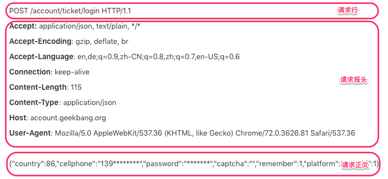
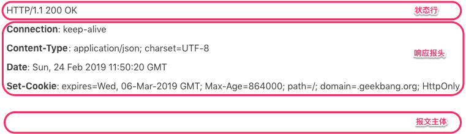

# Web容器学习路径

## Web 容器是什么

静态页面已经不能满足用户的需求，希望通过一些交互操作，来获取动态结果，因此也就需要一些扩展机制能够让**HTTP服务器调用服务端程序**。Sun推出了Servlet技术，它运行在服务端的Java小程序，但Servlet 没有main方法，不能独立运行，因此必须把它部署到Servlet容器中，由容器来实例化并调用Servlet。
Tomcat实现了Servlet容器并自带了HTTP服务器。虽然它没有实现完整的J2EE的规范但是正是这样的轻量级却被很多服务端使用。在微服务流行的当下，开发人员和架构师非常青睐稳定和轻量级实现方式，主要是当大的单体应用被拆分为功能单一服务时，减少资源消耗，降低部署成本也成为架构重要部分

## Web容器怎么学

+ 深度上多下功夫，找准一个点，深挖下去，彻底理解它的**原理和设计精髓**
+ 基础知识
  + 操作系统基础
    什么是进程
    什么是内核
    什么是内核空间和用户空间
    进程间通信的方式
    进程和线程的区别
    线程同步的方式
    什么是虚拟内存
    内存分配的过程
    什么是 I/O
    什么是 I/O 模型
    阻塞与非阻塞的区别
    同步与异步的区别
    网络通信的原理
    OSI 七层网络模型
    TCP/IP、UDP
    HTTP 协议
  + Java 语言基础
    Java 基本语法、面向对象设计的概念（封装、继承、多态、接口、抽象类等）、Java 集合的使用、Java I/O 体系、异常处理、基本的多线程并发编程（包括线程同步、原子类、线程池、并发容器的使用和原理）、Java 网络编程（I/O 模型 BIO、NIO、AIO 的原理和相应的 Java API）、Java 注解以及 Java 反射的原理
  + Java Web 开发基础
    学习一些通用的设计原则和设计模式
    学习 Servlet 和 Servlet 容器

## HTTP协议必知必会

### HTTP请求过程

1. 用户在浏览器地址栏中输入http地址
2. 浏览器和服务器端进行3次握手后，成功连接到服务器端口
3. 浏览器通过http地址，发起请求服务器http服务
4. 服务器接收到http请求地址后，解析地址
5. 读取请求内容生成HTTP请求对应的答复内容
6. 将答复内容返回浏览器
7. 浏览器将答复内容显示到页面上

### HTTP格式

+ HTTP请求格式

+ HTTP响应格式

### Cookie和Session

HTTP协议有个特点是无状态，请求与请求之间是没有关系。因此 HTTP 协议需要一种技术让请求与请求之间建立起联系，并且服务器需要知道这个请求来自哪个用户

+ Cookie技术
  Cookie是HTTP 报文的一个请求头，Web 应用可以将用户的标识信息或者其他一些信息（用户名等）存储在Cookie中。
  用户经过验证之后，每次HTTP请求报文中都包含Cookie，这样服务器读取这个Cookie请求头就知道用户是谁了。Cookie本质上就是一份存储在用户本地的文件，里面包含了每次请求中都需要传递的信息

+ Session技术

  Session可以理解为服务器端开辟的存储空间，里面保存了用户的状态，用户信息以 Session 的形式存储在服务端。当用户请求到来时，服务端可以把用户的请求和用户的Session对应起来。

  服务器在创建Session的同时，会为该 Session 生成唯一的Session ID，当浏览器再次发送请求的时候，会将这个 Session ID带上，服务器接受到请求之后就会依据 Session ID找到相应的Session，找到 Session后，就可以在Session中获取或者添加内容了。而这些内容只会保存在服务器中，发到客户端的只有Session ID，这样相对安全，也节省了网络流量，因为不需要在 Cookie中存储大量用户信息
