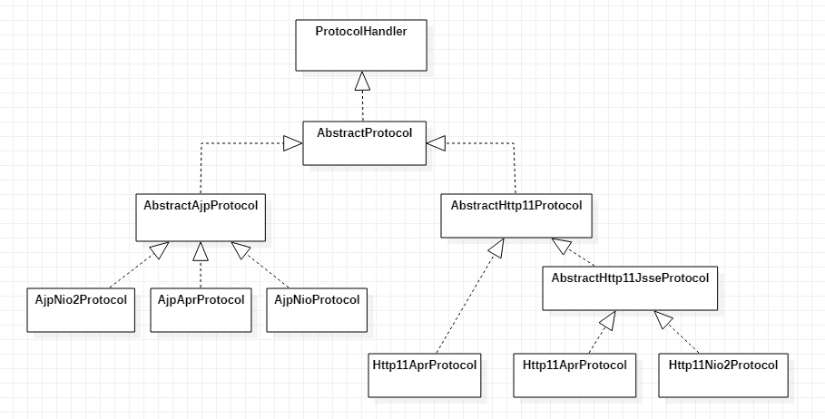
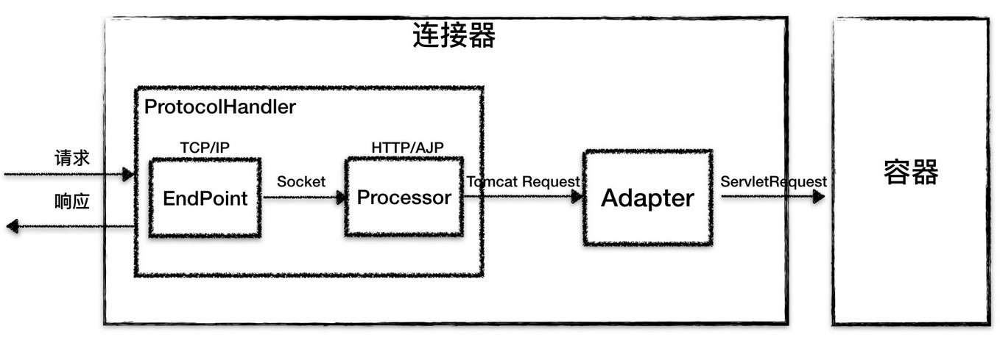
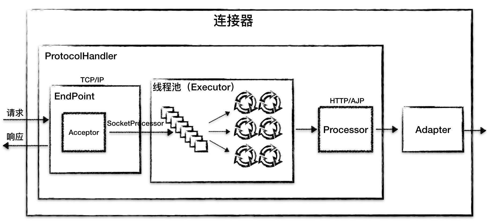

# Tomcat系统架构（上）： 连接器是如何设计的？

+ 学会从宏观上怎么去设计一个复杂系统
+ 怎么设计顶层模块，以及模块之间的关系

## Tomcat 总体架构

+ Tomcat要实现2个核心功能
  + 处理Socket 连接，负责网络字节流与 Request和Response对象的转化
  + 加载和管理Servlet，以及具体处理 Request请求

+ 两个核心组件
连接器（Connector）负责对外交流
容器（Container）来负责内部处理

## Tomcat支持I/O模型与支持协议

+ I/O模型
  + NIO：非阻塞I/O，采用Java NIO类库实现。
  + NIO.2：异步I/O，采用JDK7最新的NIO.2 类库实现。
  + APR：采用Apache可移植运行库实现，是 C/C++ 编写的本地库

+ 应用层协议
  + HTTP/1.1：这是大部分Web应用采用的访问协议。
  + AJP：用于和Web服务器集成（如 Apache）。
  + HTTP/2：HTTP2.0大幅度的提升了Web性能。

了实现支持多种 I/O 模型和应用层协议，一个容器可能对接多个连接器，
单独容器和连接器不能单独工作，需要连接一起可以工作


Service本身没有做什么重要的事情，只是在连接器和容器外面多包了一层，把它们组装在一起
Tomcat中配置多个Service，可以实现通过不同的端口号来访问同一台机器上部署的不同应用

## 连接器

  连接器对Servlet容器屏蔽了协议及I/O模型等的区别，无论是HTTP还是AJP，在容器中获取到的都是一个标准的ServletRequest对象

+ 连接器设计要求
  + 监听网络端口
  + 接受网络连接请求。读取网络请求字节流。
  + 根据具体应用层协议（HTTP/AJP）解析字节流，生成统一的TomcatRequest对象。
  + 将TomcatRequest对象转成标准的ServletRequest。
  + 调用Servlet容器，得到ServletResponse。
  + 将ServletResponse转成Tomcat Response对象。
  + 将Tomcat Response转成网络字节流。
  + 将响应字节流写回给浏览器
  
+ 设计原则
  + **高内聚**是指相关度比较高的功能要尽可能集中，不要分散。连接器需要完成3个高内聚的功能：
    + 网络通信。
    + 应用层协议解析。
    + Tomcat Request/Response与ServletRequest ServletResponse 的转化。
  + **低耦合**是指两个相关的模块要尽可能减少依赖的部分和降低依赖的程度，不要让两个模块产生强依赖。

Tomcat的设计者设计了3个组件来实现这3个功能，分别是Endpoint、Processor和Adapter。

+ Endpoint负责提供字节流给Processor
+ Processor负责提供Tomcat Request对象给Adapter
+ Adapter负责提供ServletRequest对象给容器

由于I/O模型和应用层协议可以自由组合，比如 NIO + HTTP 或者 NIO.2 + AJP。
网络通信和应用层协议解析放在一起考虑，设计了一个叫 ProtocolHandler的接口来封装这两种变化点。各种协议和通信模型的组合有相应的具体实现类

```java
//通过协议返回对应的ProtocolHandler
public static ProtocolHandler create(String protocol, boolean apr) 
```

Tomcat设计了一系列抽象基类来封装这些稳定的部分,抽象基类AbstractProtocol 实现了ProtocolHandler接口。每一种应用层协议有自己的抽象基类


### ProtocolHandler组件



+ EndPoint
通信端点，即通信监听的接口，是具体的 Socket接收和发送处理器，是对传输层的抽象，因此Endpoint是用来实现TCP/IP协议的,这个接口目前找不到，有个抽象类替代AbstractEndpoint。实现类是NioEndpoint和Nio2Endpoint，在它们中有两个重要的子组件：Acceptor 和SocketProcessor。
`protected Acceptor<U> acceptor;`
`protected SynchronizedStack<SocketProcessorBase<S>> processorCache`
  + Acceptor用于监听Socket连接请求。
  + SocketProcessor用于处理接收到的Socket请求，它实现Runnable接口，在run方法里调用协议处理组件Processor行处理。为了提高处理能力，SocketProcessor被提交到线程池来执行。而这个线程池叫作执行器(Executor)
+ Processor
接收来自Endpoint的Socket，读取字节流解析成TomcatRequest和Response对象，并通过Adapter将其提交到容器处理，Processor是对应用层协议的抽象
Processor是接口`org.apache.coyote.Processor`，它有抽象实现类AbstractProcessor封装对一些协议共有的属性进行封装，没有对方法进行实现，具体的实现有AjpProcessor、Http11Processor等

Endpoint接收到Socket连接后，生成一个SocketProcessor任务提交到线程池去处理，SocketProcessor的run方法会调用Processor组件去解析应用层协议，Processor通过解析生成Request对象后，会调用Adapter的Service方法

### Adapter 组件

由于协议不同，客户端发过来的请求信息也不尽相同，Tomcat定义了自己的Request类来“存放”这些请求信息。
ProtocolHandler接口负责解析请求并生成Tomcat Request类。但是这个Request对象不是标准的ServletRequest，不能用TomcatRequest作为参数来调用容器。
Tomcat设计者的解决方案是引入CoyoteAdapter，这是适配器模式的经典运用，连接器调用CoyoteAdapter的sevice方法，传入的是TomcatRequest对象，CoyoteAdapter负责将TomcatRequest转成ServletRequest，再调用容器的service方法
