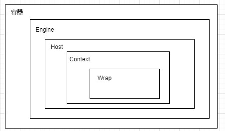

# 聊聊多层容器的设计

Tomcat有两个核心组件：连接器和容器，其中连接器负责外部交流，容器负责内部处理。具体来说就是，连接器处理Socket通信和应用层协议的解析，得到Servlet请求；而容器则负责处理Servlet请求

## 容器的层次结构

Tomcat设计了4种容器，分别是Engine、Host、Context和Wrapper,依次是父子关系



Engine表示引擎用来管理多个虚拟站点
Host表示一个虚拟主机
Context表示一个Web应用程序
Wrapper表示一个Servlet

所有容器组件都实现了Container接口，使用组合模式可以使得用户对单容器对象和组合容器对象的使用具有一致性。这里单容器对象指的是最底层的Wrapper，组合容器对象指的是上面的Context、Host或者Engine

```java

public interface Container extends Lifecycle {
    public void setName(String name);
    public Container getParent();
    public void setParent(Container container);
    public void addChild(Container child);
    public void removeChild(Container child);
    public Container findChild(String name);
}
```

## 请求定位Servlet的过程

Tomcat是怎么确定请求是由哪个Wrapper容器里的Servlet来处理的呢？
答案是:Tomcat是用Mapper组件来完成这个任务的,Mapper组件的功能就是将用户请求的URL定位到一个Servlet.
它的工作原理是：Mapper组件里保存了Web应用的配置信息，其实就是容器组件与访问路径的映射关系，比如Host容器里配置的域名、Context容器里的Web应用路径，以及Wrapper容器里Servlet映射的路径，你可以想象这些配置信息就是一个多层次的Map。

用户访问了<http://user.shopping.com:8080/order/buy>，Tomcat大致经过哪些关键过程

+ 根据协议和端口号选定Service和Engine
  Tomcat的每个连接器都监听不同的端口,Tomcat默认的 HTTP连接器监听8080端口、默认的AJP连接器监听8009端口.通过URL的端口8080，可以确定HTTP连接器，通过连接器可以确定Service组件。确定Service组件也确定了Engine容器
+ 通过域名确定Host
  在HTTP的请求的Host属性得到域名，Map组件去查找相应的Host容器。
+ 根据URL路径找到Context组件
  通过URL中/order可以获取Context组件
+ 根据URL路径找到Wrapper（Servlet）
  Mapper再根据web.xml中配置的Servlet映射路径来找到具体的Wrapper和Servlet。

### 链式请求处理过程

请求最先通过Engine容器处理，最终是Servlet请求处理，中间的过程是如何传递的？使用Pipeline-Valve管道
Pipeline-Valve是责任链模式，责任链模式是指在一个请求处理的过程中有很多处理者依次对请求进行处理，每个处理者负责做自己相应的处理，处理完之后将再调用下一个处理者继续处理

Valve接口表示一个处理点

```java
public interface Valve {
  public Valve getNext();
  public void setNext(Valve valve);
  public void invoke(Request request, Response response)
}
```

Pipeline接口,是将处理点连接起来的链表

```java
public interface Pipeline extends Contained {
  public void addValve(Valve valve);
  public Valve getBasic();
  public void setBasic(Valve valve);
  public Valve getFirst();
}
```

不同容器的Pipeline是怎么链式触发的呢？比如Engine 中 Pipeline需要调用下层容器Host中的Pipeline
因为Pipeline中还有个**getBasic**方法。这个BasicValve处于Valve链表的末端，它是Pipeline中必不可少的一个 Valve，负责调用下层容器的Pipeline里的第一个Valve


Wrapper容器的最后一个Valve会创建一个Filter链，并调用doFilter方法，最终会调到Servlet的service方法。

+ Valve 和 Filter 有什么区别吗?
  + Valve是Tomcat的私有处理过程，与Tomcat的基础架构紧耦合的。Servlet API是公有的标准，所有的Web容器包括 Jetty都支持Filter机制
  + Valve工作在Web容器级别，拦截所有应用的请求，Servlet Filter工作在应用级别，只能拦截某个Web应用的所有请求

### 思考题

Tomcat内的Context组件跟Servlet规范中的ServletContext接口有什么区别？跟Spring中的ApplicationContext又有什么关系？
