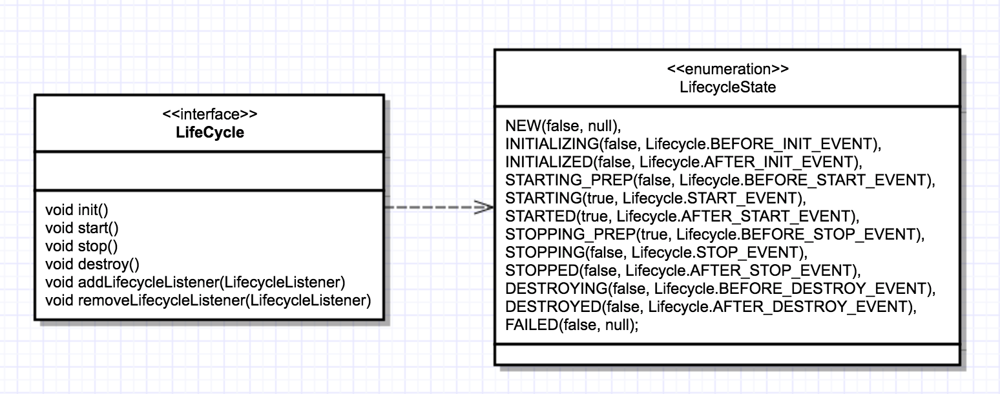

# Tomcat如何实现一键式启停

## 回顾Tomcat处理请求

描述了组件之间的静态关系，注意虚线部分是请求的处理路径

## Tomcat如何管理组件的生命周期

+ 如何统一管理组件的创建、初始化、启动、停止和销毁？
+ 如何做到代码逻辑清晰？
+ 如何方便地添加或者删除组件？
+ 如何做到组件启动和停止不遗漏、不重复？

### 组件之间的关系

+ 第一层关系是组件有大有小，大组件管理小组件，比如 Server 管理 Service，Service 又管理连接器和容器。
+ 第二层关系是组件有外有内，外层组件控制内层组件，比如连接器是外层组件，负责对外交流，外层组件调用内层组件完成业务功能。也就是说，请求的处理过程是由外层组件来驱动的。
**创建组件时应该遵循一定的顺序**
+ 第一个原则是先创建子组件，再创建父组件，子组件需要被“注入”到父组件中
+ 第二个原则是先创建内层组件，再创建外层组件，内层组件需要被“注入”到外层组件

### 系统的变化点和不变点

+ 不变点就是每个组件都要经历创建、初始化、启动这几个过程，这些状态以及状态的转化是不变
+ 变化点是每个具体组件的初始化方法，也就是启动方法是不一样的

把不变点抽象出来成为一个接口，这个接口跟生命周期有关，叫作Lifecycle。Lifecycle接口里应该定义这么几个方法：init、start、stop和destroy

父组件的init方法里需要创建子组件并调用子组件的init方法，因此调用者可以无差别的调用各组件的init方法和start方法，这就是组合模式的使用，并且只要调用最顶层组件，也就是Server组件的init和start方法，整个Tomcat就被启动起来了

#### 可扩展性：Lifecycle事件

因为各个组件init和start方法的具体实现是复杂多变的
Host容器的启动方法里需要扫描webapps目录下的Web应用，创建相应的Context容器，如果将来需要增加新的逻辑，直接修改start方法？
把组件的生命周期定义成一个个状态，把状态的转变看作是一个事件。而事件是有监听器的，在监听器里可以实现一些逻辑，并且监听器也可以方便的添加和删除，这就是典型的观察者模式

Lifecycle 接口里加入两个方法：添加监听器和删除监听器，并创建生命周期状态的枚举来定义哪些事件状态

组件的生命周期有 NEW、INITIALIZING、INITIALIZED、STARTING_PREP、STARTING、STARTED等，而一旦组件到达相应的状态就触发相应的事件，比如 NEW 状态表示组件刚刚被实例化；而当 init 方法被调用时，状态就变成 INITIALIZING 状态，这个时候就会触发BEFORE_INIT_EVENT事件，如果有监听器在监听这个事件，它的方法就会被调用

#### 重用性：LifecycleBase 抽象基类

实现类在实现接口时会有些相同的逻辑，如果让各个子类都去实现一遍，就会有重复代码，定义一个基类来实现共同的逻辑，然后让各个子类去继承它，就达到了重用的目的

基类中往往会定义一些抽象方法，所谓的抽象方法就是说基类不会去实现这些方法，而是调用这些方法来实现骨架逻辑。抽象方法是留给各个子类去实现的，并且子类必须实现，否则无法实例化

Tomcat 定义一个基类LifecycleBase来实现Lifecycle接口，把一些公共的逻辑放到基类中去，如生命状态的转变与维护、生命事件的触发以及监听器的添加和删除等

子类就负责实现自己的初始化、启动和停止等方法。为了避免跟基类中的方法同名，我们把具体子类的实现方法改个名字，在后面加上Internal，叫 initInternal、startInternal等
LifecycleBase实现了 Lifecycle 接口中所有的方法，还定义了相应的抽象方法交给具体子类去实现，这是典型的模板设计模式

### 课后思考

从文中最后的类图上你会看到所有的容器组件都扩展了ContainerBase，跟LifecycleBase一样，ContainerBase也是一个骨架抽象类，请你思考一下，各容器组件有哪些“共同的逻辑”需要ContainerBase由来实现呢？
