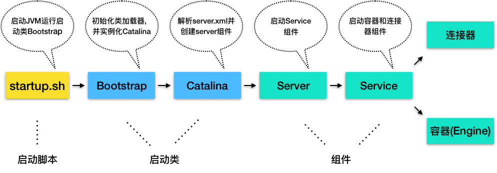

# Tomcat的“高层们”都负责做什么

## startup脚本启动Tomcat过程



+ startup.sh脚本会启动一个JVM来运行 Tomcat的启动类Bootstrap
+ Bootstrap的主要任务是初始化Tomcat 的类加载器，并且创建Catalina
+ Catalina是一个启动类，它通过解析server.xml、创建相应的组件，并调用 Server的start方法
+ Server组件的职责就是管理Service组件，它会负责调用Service的start方法
+ Service组件的职责就是管理连接器和顶层容器Engine，因此它会调用连接器和 Engine的start方法

## Catalina

Catalina的主要任务就是创建Server，它不是直接new一个Server实例就完事了，而是需要解析server.xml，把在server.xml里配置的各种组件一一创建出来，接着调用Server组件的init方法和start方法，最后注册关闭钩子，在tomcat关闭做一些清理工作。

## Server

Server组件的具体实现类是StandardServer具体实现了哪些功能。Server继承了LifecycleBase，它的生命周期被统一管理，并且它的子组件是Service，因此它还需要管理Service的生命周期，也就是说在启动时调用Service组件的启动方法，在停止时调用它们的停止方法。

```java
public void addService(Service service) {

    service.setServer(this);

    synchronized (servicesLock) {
        //创建一个长度+1的新数组
        Service results[] = new Service[services.length + 1];
        
        //将老的数据复制过去
        System.arraycopy(services, 0, results, 0, services.length);
        results[services.length] = service;
        services = results;

        //启动Service组件
        if (getState().isAvailable()) {
            try {
                service.start();
            } catch (LifecycleException e) {
                // Ignore
            }
        }

        //触发监听事件
        support.firePropertyChange("service", null, service);
    }
}
```

## Service

Service 组件的具体实现类是 StandardService,继承了LifecycleBase抽象类，此外 StandardService中还有一些我们熟悉的组件，比如Server、Connector、Engine 和 Mapper
MapperListener的作用:当 Web应用的部署发生变化时，Mapper中的映射信息也要跟着变化，MapperListener就是一个监听器，它监听容器的变化，并把信息更新到Mapper中，这是典型的观察者模式

作为“管理”角色的组件，最重要的是维护其他组件的生命周期。此外在启动各种组件时，要注意它们的依赖关系，也就是说，要注意启动的顺序

```java
protected void startInternal() throws LifecycleException {

    //1. 触发启动监听器
    setState(LifecycleState.STARTING);

    //2. 先启动Engine，Engine会启动它子容器
    if (engine != null) {
        synchronized (engine) {
            engine.start();
        }
    }
    
    //3. 再启动Mapper监听器
    mapperListener.start();

    //4.最后启动连接器，连接器会启动它子组件，比如Endpoint
    synchronized (connectorsLock) {
        for (Connector connector: connectors) {
            if (connector.getState() != LifecycleState.FAILED) {
                connector.start();
            }
        }
    }
}
```

从启动方法可以看到，Service 先启动了Engine 组件，再启动Mapper监听器，最后才是启动连接器
内层组件启动好了才能对外提供服务，才能启动外层的连接器组件。Mapper也依赖容器组件，容器组件启动好了才能监听它们的变化，因此Mapper和MapperListener在容器组件之后启动。**组件停止的顺序跟启动顺序正好相反的，也是基于它们的依赖关系**

## Engine

Engine本质是一个容器，因此它继承了ContainerBase基类，并且实现了Engine接口

```java
public class StandardEngine extends ContainerBase implements Engine
```

Engine的子容器是Host，所以它持有了一个Host容器的数组，这些功能都被抽象到了ContainerBase中

```java
protected final HashMap<String, Container> children = new HashMap<>();
```

ContainerBase 用HashMap保存了它的子容器，并且ContainerBase还实现了子容器的“增删改查”，甚至连子组件的启动和停止都提供了默认实现

```java
for (int i = 0; i < children.length; i++) {
    //用专门的线程池来启动子容器,所以Engine在启动Host子容器时就直接重用了这个方法
   results.add(startStopExecutor.submit(new StartChild(children[i])));
}
```

容器组件最重要的功能是处理请求，而Engine容器对请求的“处理”，其实就是把请求转发给某一个 Host子容器来处理，具体是通过Valve来实现的
每一个容器组件都有一个Pipeline，而Pipeline中有一个基础阀（Basic Valve），而Engine容器的基础阀定义如下

```java
final class StandardEngineValve extends ValveBase {

    public final void invoke(Request request, Response response)
      throws IOException, ServletException {
  
      //拿到请求中的Host容器
      Host host = request.getHost();
      if (host == null) {
          return;
      }
  
      // 调用Host容器中的Pipeline中的第一个Valve
      host.getPipeline().getFirst().invoke(request, response);
  }
}
```

+ 请求对象中怎么会有 Host 容器呢?
这是因为请求到达 Engine 容器中之前，Mapper组件已经对请求进行了路由处理，Mapper组件通过请求的 URL 定位了相应的容器，并且把容器对象保存到了请求对象中

## 总结

设计组件时，需要考虑两个方面：

+ 要选用合适的数据结构来保存子组件，比如Server用数组来保存Service组件，并且采取动态扩容的方式，这是因为数组结构简单，占用内存小；再比如 ContainerBase用HashMap来保存子容器，虽然Map占用内存会多一点，但是可以通过Map来快速的查找子容器。因此在实际的工作中，我们也需要根据具体的场景和需求来选用合适的数据结构。

+ 根据子组件依赖关系来决定它们的启动和停止顺序，以及如何优雅的停止，防止异常情况下的资源泄漏。这正是“管理者”应该考虑的事情

## 课后思考

Server组件的在启动连接器和容器时，都分别加了锁，这是为什么呢？
