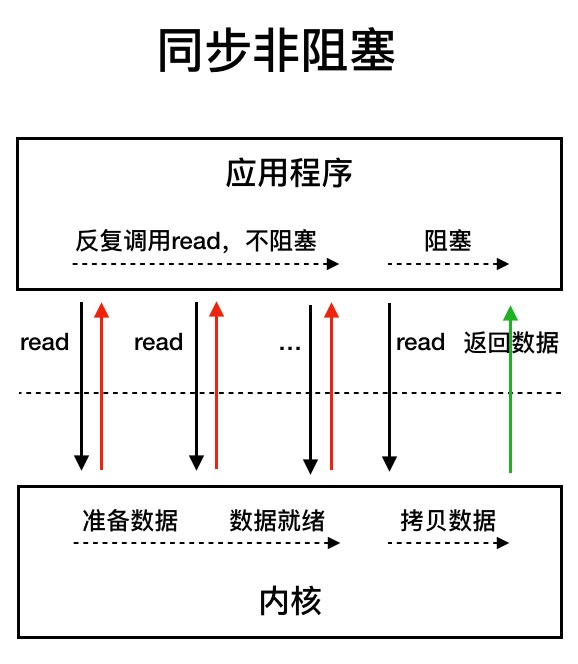
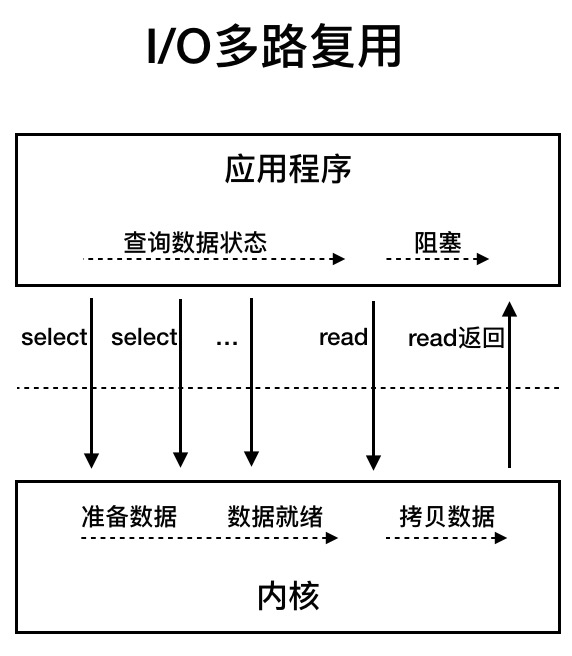
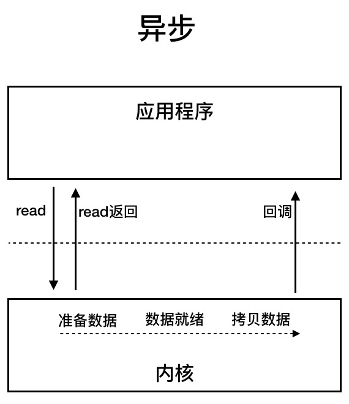

# NioEndpoint组件：Tomcat如何实现非阻塞IO

UNIX系统下的I/O模型有5种：同步阻塞I/O、同步非阻塞I/O、I/O多路复用、信号驱动I/O和异步I/O

## Java I/O 模型

+ 网络访问
网络数据读取会涉及两个对象，一个是调用这个 I/O 操作的用户线程，另外一个就是操作系统内核。一个进程的地址空间分为用户空间和内核空间，用户线程不能直接访问内核空间
当用户线程发起 I/O 操作后，网络数据读取操作会经历两个步骤:
  + 用户线程等待内核将数据从网卡拷贝到内核空间。
  + 内核将数据从内核空间拷贝到用户空间。

+ 同步阻塞I/O
用户线程发起read调用后就阻塞了，让出CPU。内核等待网卡数据到来，把数据从网卡拷贝到内核空间，接着把数据拷贝到用户空间，再把用户线程叫醒

+ 同步非阻塞I/O
用户线程不断的发起read调用，数据没到内核空间时，每次都返回失败，直到数据到了内核空间，这一次read调用后，在等待数据从内核空间拷贝到用户空间这段时间里，线程还是阻塞的，等数据到了用户空间再把线程叫醒。

+ I/O多路复用
用户线程的读取操作分成两步了，线程先发起select调用内核查多个数据通道（Channel）的状态，目的是问内核数据准备好了吗？等内核把数据准备好了，用户线程再发起read调用。在等待数据从内核空间拷贝到用户空间这段时间里，线程还是阻塞的。

+ 信号驱动I/O

+ 异步I/O
用户线程发起read调用的同时注册一个回调函数，read立即返回，等内核将数据准备好后，再调用指定的回调函数完成处理。在这个过程中，用户线程一直没有阻塞

