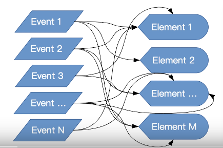
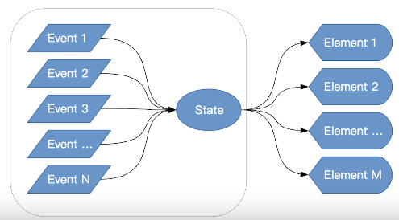
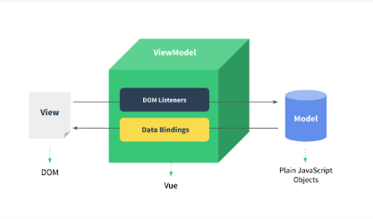
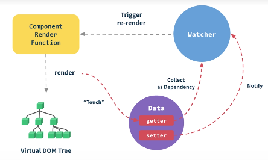
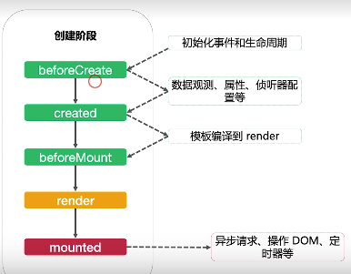
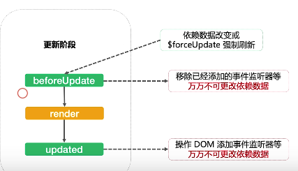
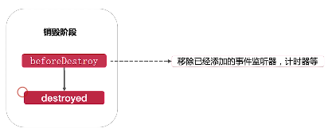

# Vue基本原理

## 虚拟DOM

JQuery简化了事件使用，但是随着事件越来越多，DOM和事件映射越来复杂


虚拟DOM将所有事件都在修改一种状态，由状态统一更新DOM,虚拟DOM是页面DOM的影子，通过模板和数据计算而来
虚拟DOM修改后就会触发页面DOM的修改，如果它没有修改那么就不会触发而节省了DOM操作，提高了性能。
虚拟DOM会比较修改前和修改后的结构，由于算法的问题只能对比相同层级的DOM，也算是折中处理


## 如何触发组建的更新

不要直接操作DOM



组件的数据有3个来源

+ 来自父元素的属性
+ 来自组件自身的状态data
+ 来自状态管理器:vuex,Vue.observable

例子:

```html
父组件调用
<div>
    <p>
        <button @click="handleNameChange">change this.name</button>
        <button @click="handleInfoChange">change this.info</button>
        <button @click="handleListChange">change this.list</button>
    </p>
    <pd :name="pd.name" :info="pd.info" :list="pd.list" />
</div>

子组件
<template>
    <div>
        <p>props.info: {{ info }}</p>
        <p>props.name: {{ name }}</p>
        <p>props.list: {{ list }}</p>
        <p>data.a: {{ a }}</p>
        <p>
            <button @click="handleBChange">change data.b</button>
            <!--<button @click="handleAChange">change data.a</button>-->
        </p>
    </div>
</template>

<script>
export default {
    name:'propAndData',
    props:{//来自父组件的数据
        info:Object,
        name:String,
        list:Array
    },
    data(){//本身的数据
        return {
            a:'hello',
            b:'word'
        }
    },
    updated() {
        console.log('触发 propanddata组件更新')
    },
    methods:{
        handleBChange() {
            this.b = 'vue' + Date.now();
            console.log("data.b 发生了变化",this.b);
        },
        //handleAChange() {
         //   this.a = 'vue' + Date.now();
        //    console.log("data.a 发生了变化",this.a);
        //}
    }
}
</script>
```

这个例子中父组件有3个属性，并且有3个对应修改的方法。子组件有2个属性和3个来自父组件的属性并有updated日志来显示子组件的更新
在父组件有3个按钮来触发对应的修改，子组件有一个修改b属性的方法。演示的父组件按钮就会触发子组件的更新，但是点击子组件的change.b按钮却不会，这说明了如果模板中没有使用到的属性也不会更新DOM。需要绑定的对象必须写在data方法返回自或者声明在props属性中。



## 合理应用计算属性和侦听器

### 计算属性(computed)

+ 减少模板中计算逻辑(放在模板中表达式可以提取到computed中)
+ 数据缓存(只有属性更新了才会调用)
+ 依赖固定的数据类型(响应式数据)

```html
<template>
    <div>
        <p>message:{{message}}</p>
        <p>comutedMethod:{{comutedMethod}}</p>
        <p>reversedMessage1:{{reversedMessage1()}}</p>
        <button @click="() => $forceUpdate()">forceUpdate</button>
        <p>{{now}}</p>
        <input v-model="message"/>
    </div>
</template>

<script>
export default {
    name:'computedDemo',
    data() {
        return {
            message:'Hello Vue'
        }
    },
    computed:{
        now:function() {
            return  Date.now();
        },
        comutedMethod:function(){
            console.info("comutedMethod");
            return this.message.split('').reverse().join('');
        }
    },
    methods:{
        reversedMessage1:function() {
            console.info("reversedMessage");
            return this.message.split('').reverse().join('');
        }
    }
}
</script>
```

例子中input绑定了message,有两个方法都是反转字符串的，模板中调用了computed属性和实例方法。
当在input中输入内容，反转的内容输出到页面，**在控制台中发现两个方法都被调用**
forceUpdate按钮是强制页面重新渲染一次，在控制台中只有实例方法被调用了，计算属性却没有

### 侦听器(watcher)

更加灵活，通用，watch中可以执行任何逻辑，如果函数节流，Ajax异步获取数据，甚至操作DOM

```javascript
export default {
    name:'watchdemo',
    data(){
        return {
            a:1,
            b:2,
            c:{
                d:3
            },
            e:{
                f:{
                    g:4
                }
            },
            h:[]
        }
    },
    watch:{
        a:function(val,oldval) {
            console.log('a','val:'+val+'|oldval:'+oldval);
            this.b += 1;
        },
        'b':function(val,oldval){
            console.log('b','val:'+val+'|oldval:'+oldval);
             this.c.d += 2;
        },
        'c.d':function(val,oldval) {
            console.log('c.d','val:'+val+'|oldval:'+oldval);
            this.e.f.g += 3;
        },
        e: {
            handler:function(val,oldval) {
                console.log('e','val:'+val+'|oldval:'+oldval);
                this.h.push('\u12345');
            },
            deep:true
        },
        h(val,oldval) {
            console.log('h','val:'+val+'|oldval:'+oldval);
        }
    },
    methods:{
        changea:function(){
            this.a+=1;
        }
    }
}
```

侦听器可以直接将监听嵌套属性,deep属性表示对属性的嵌套属性进行监听。

+ 监听属性变量(a)
+ 监听属性名称('b')
+ 监听嵌套属性的名称('c.d')
+ 监听配置对象(e),handler属性触发监听，deep属性表示对的所有嵌套属性进行监听`e.f.g`属性变化就会触发handler执行
+ immediate属性该回调将会在侦听开始之后被立即调用

## 生命周期的应用场景

### 创建阶段



+ `beforeCreate`之前会初始化事件和生命周期
+ `beforeCreate`到`created`之间数据观测,属性,侦听器配置等
+ `created`到`beforeMount`之间模板编译到render
+ `mounted`异步请求，操作DOM，定时器等

### 更新阶段



更新阶段是一个多次执行的阶段

+ `beforeUpdate`由依赖数据改变时候或$forceUpdate强制刷新时候
+ `beforeUpdate`阶段发生移除已经添加的事件监听器等**万万不可更改依赖数据**
+ `updated`操作DOM添加事件监听器等**万万不可更改依赖数据**

### 销毁阶段



+ `beforeDestory`移除已经添加的事件监听器，计时器等

## 函数式组件

