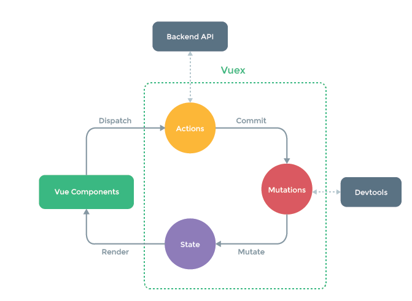

# Vue生态

## Vuex状态管理

多个组件需要共享同一个数据或者数据修改后组件需要更新。

+ 将数据保存到在公有的父项中属性中，通过属性层层传递
+ provide和inject
+ 如果状态非常复杂需要vuex来管理

交互图

vuex已经和组件没有强相关的内容了,可以独立的提供相应式数据

1. Vuex提供数据驱动视图(Vue Components)
2. 视图通过Disppatch派发Actions
3. 在Action中可以做一些异步的操作(Ajax获取后端数据)
4. 通过Commit形式提交给mutation
5. 由mutation最终更改state,提交记录有devtool记录更改
