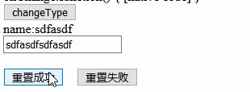

# 组件核心概念

核心概念:属性,事件,插槽

## 属性

属性分为自定义属性props,原生属性attrs,特殊属性class,style

|属性|描述|
|-|-|
|props|组件props中声明的属性|
|attrs|没有声明的属性,默认自动挂载到组件根元素上,inheritAttrs为false可以关闭自动挂载|
|class,style|挂载到组件根元素上,支持字符串,对象,数组等多种语法|

props是接受父组件的传值声明,并在子组件中使用这些数据

```javascript
props:{
    name1:{//定义name属性是字符型
        type:String
    },
    type: {
        validator:function(value){//新增校验器
            return ['success','warning','danger'].includes(value);
        }
    },
    list:{//数组类型属性定义
        type:Array,
        default:() => []
    },
    isVisible:{//布尔类型定义
        type:Boolean,
        default:false
    },
    onChange: {//函数类型
        type:Function,
        default:() => {}
    }
}
```

子组件需要声明父组件传值的类型,可以使用default属性设置默认值,也可以添加对属性的校验器`validator`
在父组件中使用子组件

```html
<propsdemo
    v-bind:name1="msg"
    v-bind:list="list"
    v-bind:is-visible="false"
    :type="type"
    v-bind:onChange="handlePropChange"
/>
```

1. 使用`v-bind`指令可以将数据传入子组件,也可以用简写方法`:propName`,比如type属性和onChange属性
2. 注意等号后面的字符串可以是父组件的变量名称也可以是字面量比如:`is-visible`
3. 这些绑定的子组件变量如果驼峰命令,在父组件传值需要写成短横线分割,参考[官方文档](https://cn.vuejs.org/v2/guide/components-props.html#Prop-%E7%9A%84%E5%A4%A7%E5%B0%8F%E5%86%99-camelCase-vs-kebab-case)

## 事件

事件分为普通事件和修饰符事件

普通事件:@click,@input,@change,@xxx事件,通过this.$emit('xxx',...)触发
修饰符事件:@input.trim,@click.stop,@submit.prevent等,一般用于原生HTML元素,自定义组件需要自行开发支持

例子:



有两个按钮点击后重置父组件的msg属性
重置成功使用普通事件,没有阻止事件的冒泡,导致触发了父组件的两次chang事件,一次input,一次是div的handleDivClick(冒泡)
input触发后将父组件新的值设置成功后,div又调用父组件的事件设置空值
重置失败使用修饰符事件`@click.stop`阻止了div的handleDivClick事件的冒泡,父组件没有变成空值

```html
<!--父组件handleMsgChange事件修改msg属性-->
<div>
    <eventdemo :name="msg" @change="handleMsgChange"></eventdemo>
</div>

<!--子组件-->
<template>
    <div>
        name:{{name||'--'}}<br />
        <input :value="name" @change="handleChange" />
        <br />
        <br />
        <div @click="handleDivClick">
            <button @click="handleClick">重置成功</button>&nbsp;&nbsp;&nbsp;
            <button @click.stop="handleClick">重置失败</button>
        </div>
    </div>
</template>

<script>
export default {
    name:'eventdemo',
    props:{
        name:String
    },
    methods:{
        handleChange(e){//input调用事件
            console.log('input调用事件',e.target.value);
            this.$emit('change',e.target.value);
        },
        handleDivClick() {//div调用事件
            console.log('div调用事件');
            this.$emit('change',"");
        },
        handleClick(e){//按钮调用事件
            console.log('按钮调用事件');
            //e.stopPropagation();//阻止冒泡
        }
    }
}
```

## 插槽

普通插槽和作用域插槽,在2.6以后推荐作用域插槽

